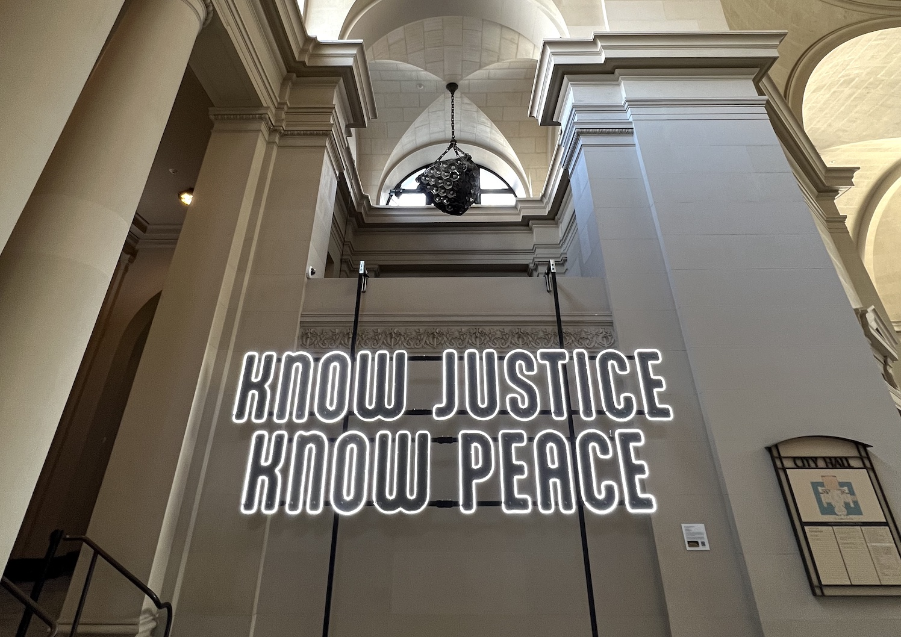
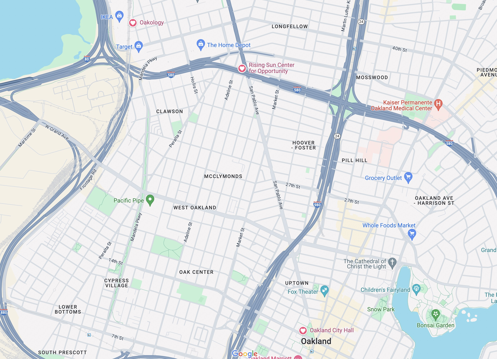

BLM Neon Voices (#blmneonvoices)
=======================

In reaction to police violence and racism, a group of Bay Area artists and creators have collaborated to create Neon Voices, a large-scale, modular display with potent anti-racism statements and images. The artworks incorporate LED lighting and effects for high-visibility impact. In collaboration with community members, the artists plan to install the artwork on prominent Bay Area buildings and open spaces. 

The first installation is a “BLACK LIVES MATTER” sign featuring a striking graphic designed by local Oakland artist, [Abi Mustapha](https://abimustapha.com).  This sign is currently on display at the [Rising Sun Center for Opportunity](https://risingsunopp.org/) building in Emeryville and is visible from I-580 to thousands of cars daily.

The second installatio, "K(NO)W JUSTICE, K(NO)W PEACE", is a billboard-sized animated art project installed in Oakland’s City Hall. “No Justice, No Peace” is a powerful social justice slogan which originated in the 1980s during protests against acts of violence against African Americans. By adding a K and W to the “NO” in the slogan, we are emphasizing the conjunctive interpretation that neither peace nor justice can exist without the other. Each of the twenty 26” tall letters was CNC cut, painted and then wrapped in 200’ of LEDs. The mounting system is industrial-strength and modular so that we can transport and easily install at different locations. A computer performs animation to toggle between “NO JUSTICE NO PEACE” and “KNOW JUSTICE KNOW PEACE”.

This is the open source repository (MIT License) that will contain all the construction information for these works.  We'll be including software, bill of materials, assembly instructions, budget and tips and tricks on how to assemble a similar sign for your own statements for racial equity.  The project is entering the next phase of development and we'll keep updating here with more detailed information.

Please use #lumencrew in social media and if you'd like to contribute to follow on deployments, please use Venmo (@Mauricio-Bustos)

The top level directory here is the Python code that manages the illumination and animation.  The support directory contains the CNC cut files, layouts for the [OSC](https://hexler.net/products/touchosc) controller, design documents for the control box and budgeting information.

