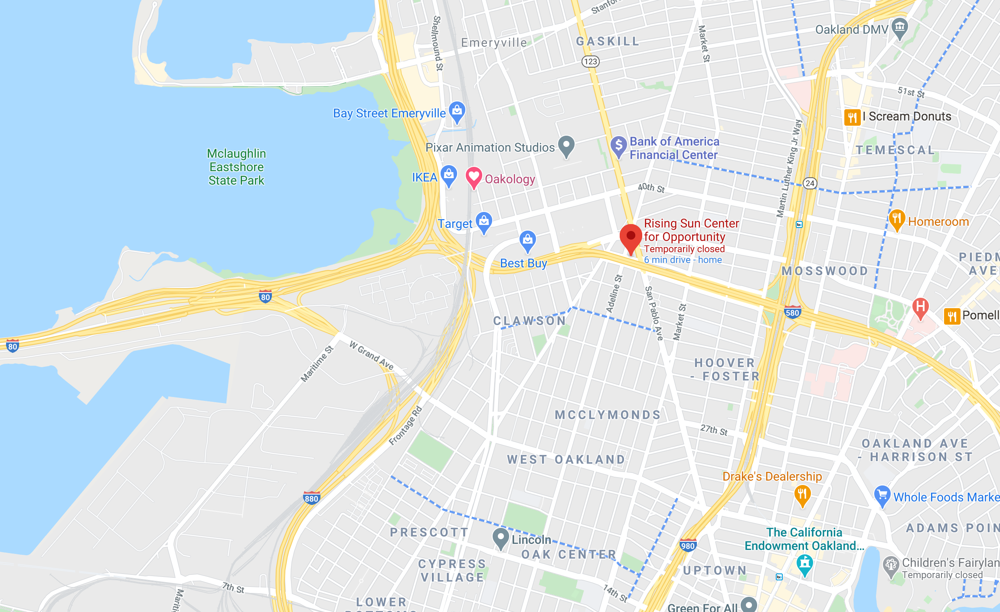

BLM Neon Voices (#blmneonvoices)
=======================

This is the open source repository (MIT License) that will contain all the construction information for the Black Lives Matter sign that is currently deployed on top of the building owned by Rising Sun Center for Opportunity.  We'll be including software, bill of materials, assembly instructions, budget and tips and tricks on how to assemble a similar sign for your own statements for racial equity.  The project is entering the next phase of development and we'll keep updating here with more detailed information.

The top level directory here is the Python code that manages the illumination and animation.  The support directory contains the CNC cut files, layouts for the OSC controller, design documents for the control box and budgeting information.

